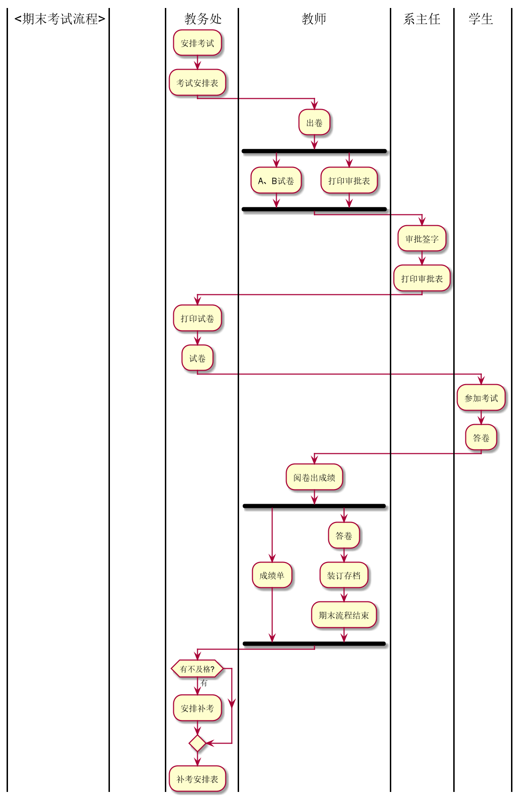
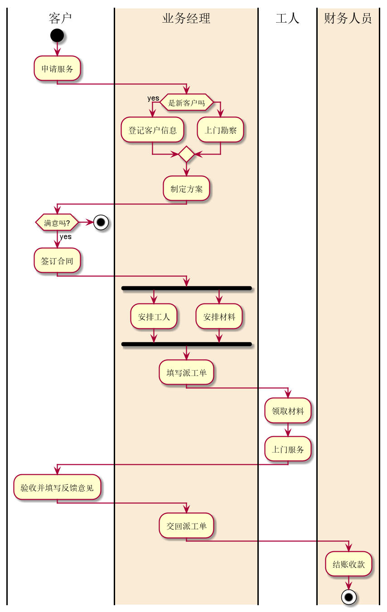

#实验1：业务流程建模
| 姓名  |  学号 | 班级 |
| :-----| ----: | :----: |
| 钟港 | 201710414130 | 17级软工1班 |


###流程图1：考试及成绩管理流程
PlantUML源码如下：
```
@startuml
|<期末考试流程>|
|              |
|教务处|
:安排考试;
:考试安排表;
|教师|
:出卷;
fork
:A、B试卷;
fork again
:打印审批表;
end fork
|系主任|
:审批签字;
:打印审批表;
|教务处|
:打印试卷;
:试卷;
|学生|
:参加考试;
:答卷;
|教师|
:阅卷出成绩;
fork
:成绩单;
fork again
:答卷;
:装订存档;
:期末流程结束;
end fork
|教务处|
if (有不及格?)then(有)
:安排补考;
endif
:补考安排表;
|教师|
@enduml
```
业务流程图如下:

流程说明：
    教务处安排考试，同时设计考试安排表，交由教师出A、B两套试卷，打印出审批表交由系主任审批签字，签完字之后打印审批表，
    完成之后便可以让教务处打印试卷，学生可以参加考试，答卷完成的试卷交由教师评阅，将答卷装订成册，同时由教务处检查是否有学生不及格
    ，如果有则安排补考，同时打印出补考安排表，至此期末考试结束。
    
###流程图2：客户维修服务流程
PlantUML源码如下：
```
@startuml
|客户|
start
:申请服务;
|#AntiqueWhite|业务经理|
if(是新客户吗)then(yes)
:登记客户信息;
else
:上门勘察;
endif
:制定方案;
|客户|
if(满意吗?)then(yes)
:签订合同;
else
stop
endif
|业务经理|
fork
:安排工人;
fork again
:安排材料;
end fork
:填写派工单;

|工人|
:领取材料;
:上门服务;
|客户|
:验收并填写反馈意见;
|业务经理|
:交回派工单;
|#AntiqueWhite|财务人员|
:结账收款;
stop
@enduml
```
业务流程图如下：

流程说明:
    客户首先申请服务，业务经理再根据是否是新客户做出判断，是新用户便登记客户信息，然后再上门勘察，如果不是新客户，就可以直接上门勘察
    ，之后根据勘察情况制定方案。之后了解客户是否满意，如果满意可以和客户签订服务合同，签订了合同之后业务经理便开始安排工人和材料
    ，并填写派工单，之后工人前去领取材料，上门服务，客户完成验收和填写反馈意见。将派工单交回给业务经理，最后财务人员结算并且收款。


