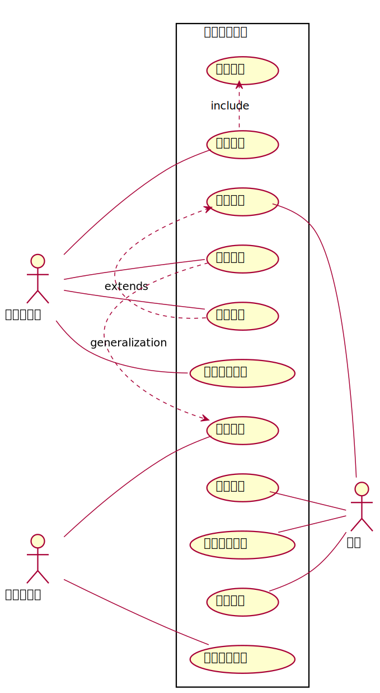
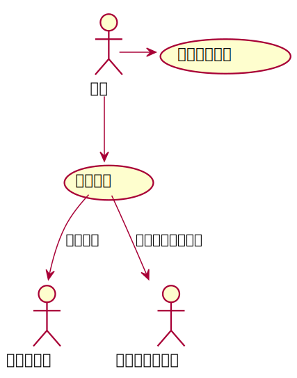

#实验2图书管理系统用例建模
| 姓名  |  学号 | 班级 |
| :-----| ----: | :----: |
| 钟港 | 201710414130 | 17级软工1班 |
##图书管理系统的用例关系图

###1.1用例图plantuml源码如下
```
@startuml
left to right direction
skinparam packageStyle rectangle
actor 图书管理员
actor 读者
actor 图书采购员
rectangle 图书馆里系统 {
  图书管理员 -- (借出图书)
  图书管理员 -- (归还图书)
  图书管理员 -- (维护书目)
  图书管理员 -- (维护读者信息)
  (查询书目) -- 读者
  (查询借阅情况) -- 读者
  (预定图书) -- 读者
  (取消预订) -- 读者
  (借出图书) .> (预订图书) : include
  (归还图书) .> (取消预订) : extends
  图书采购员 -- (购买图书)
  图书采购员 -- (损毁图书返厂)
  (维护书目).>(购买图书) : generalization
}
@enduml
```
###1.2用例图效果如下

##2.参与者说明：
###2.1图书管理员
主要职责：管理图书馆的图书的借还以及图书的保存情况
###2.2读者
主要职责：随时掌握自己借书和还书的情况以及对于书籍的保护情况
###2.3图书采购员
主要职责：对于损坏的图书即时的购买避免书籍的短缺，以及对于书籍的处理
##3.用例表
###3.1借出图书的用例表
####用例代码展示
```
@startuml
图书管理员 --(借出图书)
(借出图书) --> (预订图书):前提
(预订图书) --读者
@enduml
```
效果展示

###3.2归还图书用例表
源码展示
```aidl
@startuml
读者--(取消预订)
(取消预订)-->(归还图书):图书管理员
(归还图书)-->(维护书目)
(维护书目)-->(维护读者信息):书目正常
(维护书目)->(购买图书):图书书目异常
(购买图书)--图书采购员
@enduml
```
流程图源码如下：

###3.3查阅书籍用例表
源码展示
```aidl
@startuml
读者-->(查询书目)
读者->(查询借阅情况)
(查询书目)-->图书管理员:书目正确
(查询书目)-->图书赔偿管理员:书目异常照价赔偿
@enduml
```
流程图源码如下：

###3.4图书采购用例表
源码展示
```aidl
@startuml
图书采购员--(购买图书)
图书采购员-->(损坏图书的处理)
(购买图书)-->图书赔偿管理员:知晓应购买的图书数量
图书赔偿管理员-->图书采购员:账单报销
(损坏图书的处理)-->图书赔偿管理员:处理结果
@enduml
```
流程图源码如下：
