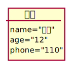

#实验3图书管理系统领域对象建模
| 姓名  |  学号 | 班级 |
| :-----| ----: | :----: |
| 钟港 | 201710414130 | 17级软工1班 |
###1.图书管理系统类图
####1.1类图源码如下
```aidl
@startuml

图书管理员"1"--|>"many"图书书目
图书书目 *-- 借出图书
图书书目 o-- 预订图书
图书管理员"1"--|>"many"读者
读者 -- 查询借阅书籍情况
读者 --|> 取消预订
借出图书--书籍损坏
书籍损坏--|>图书采购员
借出图书--|>预订图书 : include
预订图书--取消预订 :generalization

class 图书采购员{
      采购缺少的图书
}
class 书籍损坏{
      购买新书籍
      处理损坏书籍
}
class 查询借阅书籍情况{
      查询借阅书籍数量
      查询归还书籍日期
      查询是否逾期归还
}
class 取消预订{
      取消不需要的书籍
      取消预订借书
}
class 读者{
      读者姓名
      读者身份证号码
      读者联系电话
      读者家庭住址
}
class 图书书目 {
      书籍种类
      书籍数量
      价格
      简介
}
class 借出图书{
      借出数量
      借出时间
}
class 预订图书{
      预订借书名称
      预订借书时间
}
@enduml
```
####1.2类图如下

####1.3类图说明
   #####说明文字：主要的类有这几个：图书管理员、读者、图书采购员、损坏书籍、图书预订、预订取消、借出图书、图书书目、图书查......主要是对于图书管理员以及读者和图书采购员进行的建模，通过各个角色不同的分工明确了对于图书管理的不同环节，确保对于图书的使用是一个完整的体系
   
###2.图书管理系统的对象类
####2.1类图书管理员的对象图
#####源码如下
```aidl
object 图书管理员{
       name="管理员"
       id="1"
}
```

####2.2类读者的对象图
#####源码如下
```aidl
object 读者{
       name="读者"
       age="12"
       phone="110"
}
```

####2.3类图书采购员的对象图
#####源码如下
```aidl
object 图书采购员{
       name="采购员"
       id="2"
}
```

####2.4类损坏图书的对象图
#####源码如下
```aidl
object 损坏图书{
       name="损坏书名"
       price="money"
}
```

####2.5类查询借阅书籍情况的对象图
#####源码如下
```aidl
object 查询借阅书籍情况{
       number="查询借阅书籍数量"
       time="查询归还书籍日期"
       backtime="查询是否逾期归还"
}
```

####2.6类图书书目的对象图
#####源码如下
```aidl
object 图书书目{
       lei="书籍种类"
       number="书籍数量"
       price=" 价格"
       produce="简介"
}
```

####2.7类借出图书的对象图
#####源码如下
```aidl
object 借出图书{
        number=" 借出数量"
        time="借出时间"
}
```


