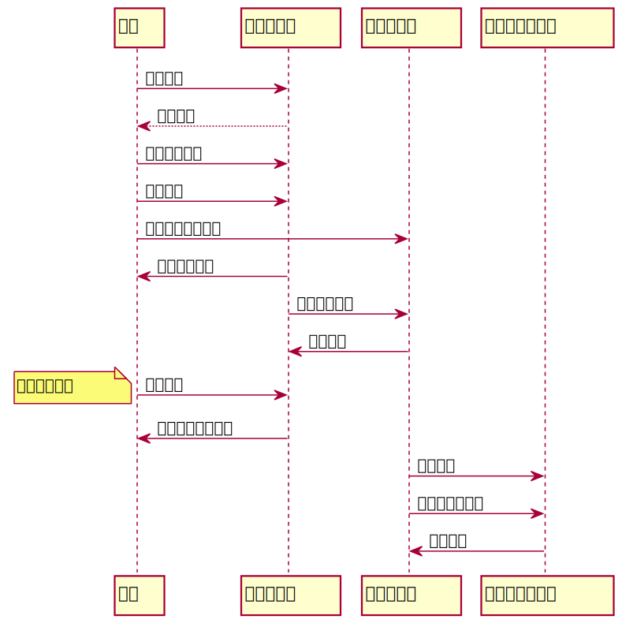
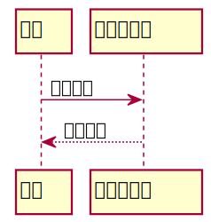
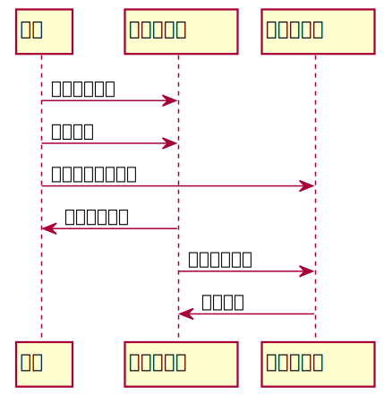
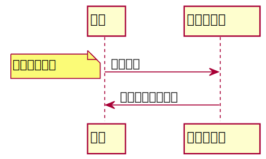
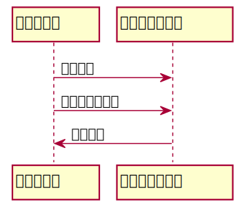

#实验4.图书管理系统顺序图绘制
| 姓名  |  学号 | 班级 |
| :-----| ----: | :----: |
| 钟港 | 201710414130 | 17级软工1班 |

##图书管理系统的顺序图
###1.系统顺序图源码
```aidl
@startuml
读者-> 图书管理员: 预约借书
图书管理员 -->读者 : 借出图书

读者->图书管理员:取消图书预订
读者->图书管理员:归还图书
读者->图书采购员:按价赔偿损坏书籍
图书管理员->读者:维护读者信息
图书管理员->图书采购员:图书数目不符
图书采购员->图书管理员:购买图书

读者->图书管理员:查询书目
note left:查询借阅情况
图书管理员->读者:书籍归还是否有误

图书采购员->图书赔偿管理员:购买图书
图书采购员->图书赔偿管理员:损坏图书的处理
图书赔偿管理员->图书采购员:账单报备

@enduml
```
###1.1系统用例顺序图


###2.借书用例顺序图
####2.1源码展示
```aidl
读者-> 图书管理员: 预约借书
图书管理员 -->读者 : 借出图书
```
####2.2借书用例顺序图

####2.3借书用例顺序图说明
读者想要去图书馆借书需要提前与图书馆进行预订，目的是为了确定是否有想要借的书可以借出，如果没有就回绝读者，如果有表示预约成功，读者可以在指定时间内完成借书

###3.还书用例顺序图
####3.1还书用例顺序图源码
```aidl
读者->图书管理员:取消图书预订
读者->图书管理员:归还图书
读者->图书采购员:按价赔偿损坏书籍
图书管理员->读者:维护读者信息
图书管理员->图书采购员:图书数目不符
图书采购员->图书管理员:购买图书
```
####3.2还书用例顺序图

####3.3还书用例顺序图说明
读者将图书归还给图书馆，图书管理员按约维护读者信息，同时图书管理员检查图书是否有损坏，如果有通知图书采购员对此进行相应的处理，读者按价赔偿书籍，图书采购员购买了图书之后，将相关的信息反馈给图书管理员。
###4.查询图书用例顺序图
####4.1查询图书用例顺序图源码
```aidl
读者->图书管理员:查询书目
note left:查询借阅情况
图书管理员->读者:书籍归还是否有误
```
####4.2查询图书用例顺序图

####4.3查询图书用例顺序图说明
读者可以自主查询自己的借阅情况了解图书是否逾期，通过与图书管理员查询，图书管理员把书籍归还是否有误的情况反馈给读者
###5.购买图书用例顺序图
####5.1购买图书用例顺序图源码
```aidl
图书采购员->图书赔偿管理员:购买图书
图书采购员->图书赔偿管理员:损坏图书的处理
图书赔偿管理员->图书采购员:账单报备
```
####5.2购买图书用例顺序图

####5.3购买图书用例顺序图说明
图书采购员需要根据图书损坏的情况进行相应的购买，以及对于损坏的图书的处理等情况反馈给图书赔偿管理员，图书赔偿管理员负责将账单报备
