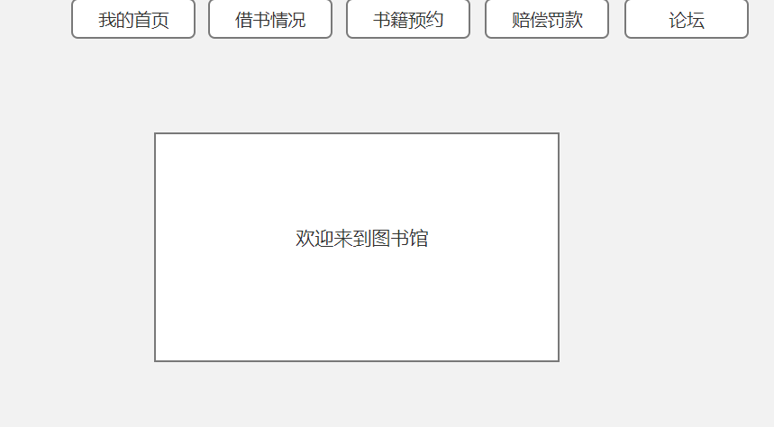
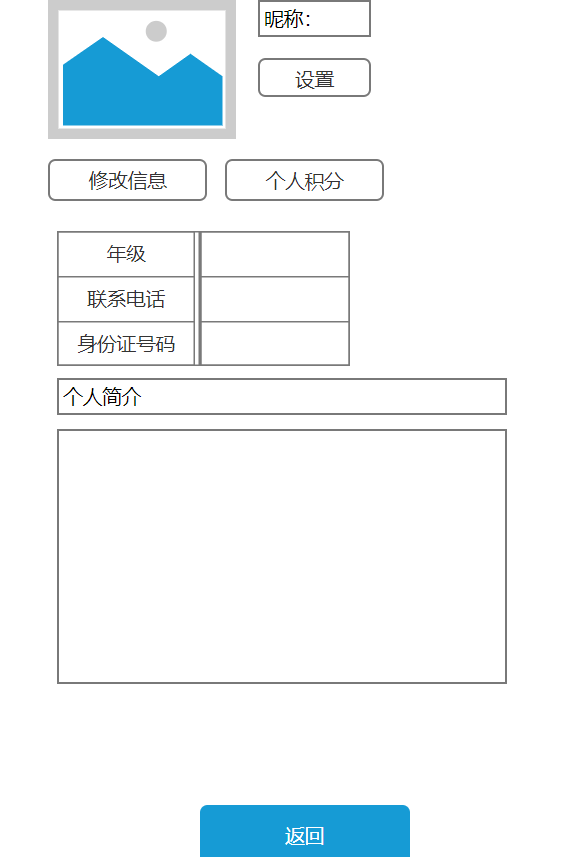
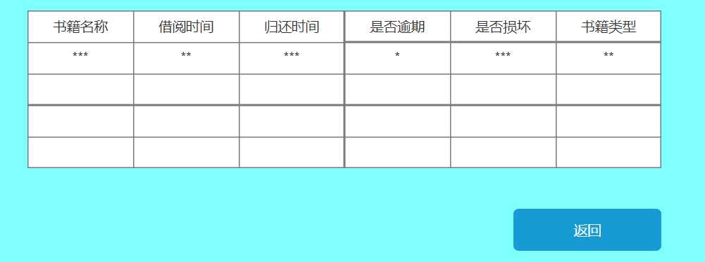
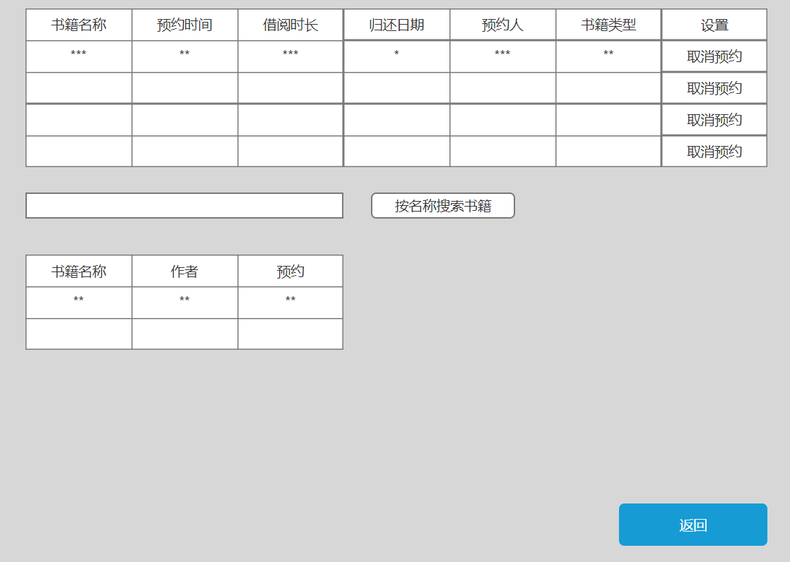
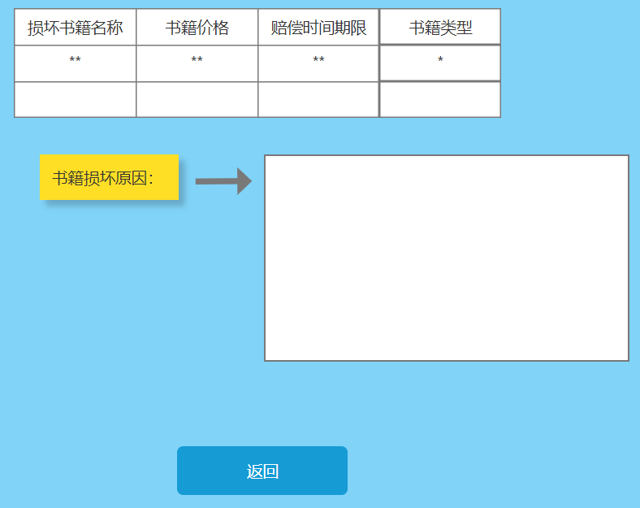

#实验5.图书管理系统数据库设计与界面设计
| 姓名  |  学号 | 班级 |
| :-----| ----: | :----: |
| 钟港 | 201710414130 | 17级软工1班 |

##1.数据库表设计
###1.1图书表
| 字段  |  类型 | 主键、外键 |可以为空| 默认值  |  约束 | 说明 |
| :-----| ----: | :----: |:-----| ----: | :----: |:----: |
| BookNO  | varchar(200)  | 主键 | 否 |   |   |  |
| BookName  | varchar(200)  |  | 否 |   |   |  |
| Booknum  | varchar(200)  |  | 是 |   |   |  |

###1.2用户表
| 字段  |  类型 | 主键、外键 |可以为空| 默认值  |  约束 | 说明 |
| :-----| ----: | :----: |:-----| ----: | :----: |:----: |
| CustomerNO  | varchar(200)  | 主键 | 否 |   |   |  |
| CustomerName  | varchar(200)  |  | 否 |   |   |  |
| Customernum  | varchar(200)  |  | 是 |   |   |  |
| Customerage  | varchar(20)  |  | 是 |   |   |  |
| Customerphone  | varchar(200)  |  | 否 |   |   |  |
###1.3图书管理员
| 字段  |  类型 | 主键、外键 |可以为空| 默认值  |  约束 | 说明 |
| :-----| ----: | :----: |:-----| ----: | :----: |:----: |
| administratorsNO  | varchar(200)  | 主键 | 否 |   |   |  |
| administratorsName  | varchar(200)  |  | 否 |   |   |  |
| administratorsnum  | varchar(200)  |  | 是 |   |   |  |
###1.4图书借阅表
| 字段  |  类型 | 主键、外键 |可以为空| 默认值  |  约束 | 说明 |
| :-----| ----: | :----: |:-----| ----: | :----: |:----: |
| BookNO  | varchar(200)  | 主键 | 否 |   |   |  |
| BookName  | varchar(200)  |  | 否 |   |   |  |
| Booknum  | varchar(200)  |  | 是 |   |   |  |
| Bookprice  | varchar(200)  |  | 是 |   |   |  |
| Bookbacktime  | varchar(200)  |  | 否 |   |   |  |
| Booktime  | varchar(200)  |  | 否 |   |   |  |
| Bookrighttime  | boolen  |  | 否 |   |   |  |

###1.5图书预约表
| 字段  |  类型 | 主键、外键 |可以为空| 默认值  |  约束 | 说明 |
| :-----| ----: | :----: |:-----| ----: | :----: |:----: |
| BookNO  | varchar(200)  | 主键 | 否 |   |   |  |
| BookName  | varchar(200)  |  | 否 |   |   |  |
| Booknum  | varchar(200)  |  | 是 |   |   |  |
| Bookprice  | varchar(200)  |  | 是 |   |   |  |
| Bookyuyuetime  | varchar(200)  |  | 否 |   |   |  |
###1.6图书数目表
| 字段  |  类型 | 主键、外键 |可以为空| 默认值  |  约束 | 说明 |
| :-----| ----: | :----: |:-----| ----: | :----: |:----: |
| BookNO  | varchar(200)  | 主键 | 否 |   |   |  |
| Bookproduce  | varchar(200)  |  | 否 |   |   |  |
| Booknum  | varchar(200)  |  | 是 |   |   |  |
| Bookprice  | varchar(200)  |  | 是 |   |   |  |
##2.界面设计
###2.1 首页界面设计
 https://zglearn78235903.github.io/is_analysis_pages/index.html
 
###2.2读者界面设计

类图参见：读者类  
顺序图参见：读者个人顺序图  
API接口如下：
功能：获取个人简易信息  
请求地址：http://book/v1/api/user  
请求方法：GET  
请求参数：  

| 参数名称  |  必填 | 说明 |
| :-----| ----: | :----: |
| ruletake | 是 | 用于验证请求合法性的认证信息 |
| method | 是 | GET |  
返回实例：  
```androiddatabinding
{
    "info":"读者信息",
    "data": {
         "CustomerId":"***",
         "CustomerName":"***",
         "Customerphone":"***",
         "Customeraddress":"***",
      }
     "code":200
}
```
返回参数说明： 
   
| 参数名称  |  说明 |  
| :-----| ----: | 
| info | 返回信息 |   
| CustomerId | 读者编号 |
| CustomerName | 读者姓名 |
| Customerphone | 读者联系电话 |
| Customeraddress | 读者家庭住址 |
| code | 返回码 |
 
 
 ###2.3借阅书籍情况查询界面
 
类图参见：书籍借阅类，图书书目类  
顺序图参见：借阅图书顺序图  
请求地址：http://book/v1/api/save  
请求方法：GET     

请求参数：  

| 参数名称  |  必填 | 说明 |
| :-----| ----: | :----: |
| ruletake | 是 | 用于验证请求合法性的认证信息 |
| method | 是 | GET |  
返回实例：  
```androiddatabinding
{
    "info":"借阅情况",
    "data": {
         "BookId":"***",
         "BookName":"***",
         "Savetime":"***",
         "Savebacktime":"***",
         "timeisright":"yes",
      }
     "code":200
}
```
返回参数说明： 
   
| 参数名称  |  说明 |  
| :-----| ----: | 
| info | 返回信息 |   
| BookId | 书籍编号 |
| BookName | 书籍名称 |
| Savetime | 借阅时间 |
| Savebacktime | 借阅归还时间 |  
| timeisright | 是否逾期归还 |
| code | 返回码 |

###2.4书籍预约界面
  
类图参见：书籍预约类，图书类  
顺序图参见：预约图书顺序图  
请求地址：http://book/v1/api/order   
请求方法：GET     

请求参数：  

| 参数名称  |  必填 | 说明 |
| :-----| ----: | :----: |
| ruletake | 是 | 用于验证请求合法性的认证信息 |
| method | 是 | GET |  
返回实例：  
```androiddatabinding
{
    "info":"预约图书情况",
    "data": {
         "BookId":"***",
         "BookName":"***",
         "Ordertime":"***",
         "Savebacktime":"***",
         "Ordername":"***",
      }
     "code":200
}
```
返回参数说明： 
   
| 参数名称  |  说明 |  
| :-----| ----: | 
| info | 返回信息 |   
| BookId | 书籍编号 |
| BookName | 书籍名称 |
| Ordertime | 预约时间 |
| Savebacktime | 预约借阅归还时间 |  
|Ordername | 预约人 |
| code | 返回码 |

###2.5赔偿罚款界面

类图参见：图书类  
顺序图参见：赔偿图书顺序图  
请求地址：http://book/v1/api/satisfaction   
请求方法：GET     

请求参数：  

| 参数名称  |  必填 | 说明 |
| :-----| ----: | :----: |
| ruletake | 是 | 用于验证请求合法性的认证信息 |
| method | 是 | GET |  
返回实例：  
```androiddatabinding
{
    "info":"赔偿图书情况",
    "data": {
         "BookId":"***",
         "BookName":"***",
         "Bookprice":"***",
         "satisfactionname":"***",
      }
     "code":200
}
```
返回参数说明： 
   
| 参数名称  |  说明 |  
| :-----| ----: | 
| info | 返回信息 |   
| BookId | 书籍编号 |
| BookName | 书籍名称 |
| Bookprice | 书籍价格 |  
|satisfactionname | 赔偿人姓名 |
| code | 返回码 |