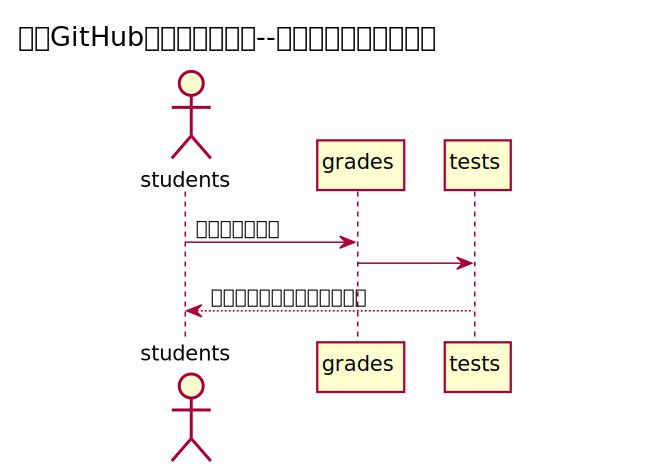

#查看成绩用例

###1.用例规约
| 用例名称  |  查看成绩 |
| :-----| ----: | 
| 功能 | 查看用户的成绩 |
| 参与者	 | 学生|
| 条件 | 需要先登录 |
| 主事件流	 |  |
| 备选事件流 | |

###2.业务流程

源码：
https://github.com/Zglearn78235903/is_analysis/test6/src/sequence查看成绩.puml

###3.界面设计
界面参照：
https://github.com/Zglearn78235903/is_analysis/test6/ui/查看成绩.html

API接口：
https://github.com/Zglearn78235903/is_analysis/test6/接口/getOneStudentResult.md
###4.参照表
 https://github.com/Zglearn78235903/is_analysis/test6/数据库设计.md