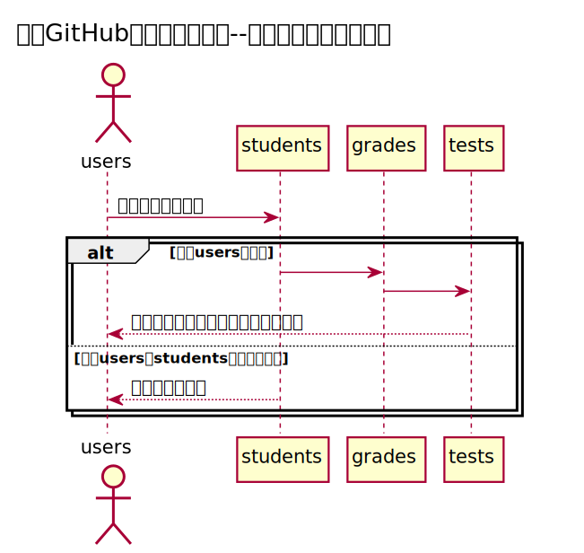

#查看用户信息用例

###1.用例规约
| 用例名称  |  查看用户信息 |
| :-----| ----: | 
| 功能 | 查看用户的信息 |
| 参与者	 | 学生/老师 |
| 条件 | 需要先登录 |
| 主事件流	 |  |
| 备选事件流 | |

###2.业务流程

源码：
https://github.com/Zglearn78235903/is_analysis/test6/src/sequence学生列表.puml

###3.界面设计
界面参照：
https://github.com/Zglearn78235903/is_analysis/test6/ui/student.html

API接口：
https://github.com/Zglearn78235903/is_analysis/test6/接口/getUse.md

###4.参照表
 https://github.com/Zglearn78235903/is_analysis/test6/数据库设计.md