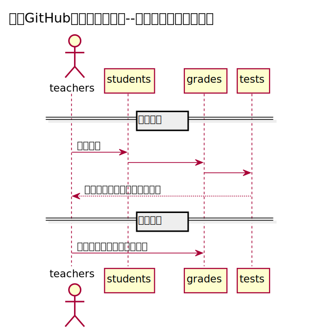

#评定成绩用例

###1.用例规约

| 用例名称  |  评定成绩 |
| :-----| ----: | 
| 功能 | 老师评定一个学生的实验成绩 |
| 参与者	 | 老师 |
| 条件 | 需要先登录 |
| 主事件流	 | 输入一个或者多个实验的成绩和评语 |
| 备选事件流 | 成绩必须是0至100之间，可以为空，但不能超界|

###2.业务流程

源码：
https://github.com/Zglearn78235903/is_analysis/test6/src/sequence评定成绩.puml

###3.界面设计

界面参照：
https://github.com/Zglearn78235903/is_analysis/test6/ui/成绩评定.html

API接口：
https://github.com/Zglearn78235903/is_analysis/test6/接口/getOneStudentResult.md

###4.参照表
 https://github.com/Zglearn78235903/is_analysis/test6/数据库设计.md
